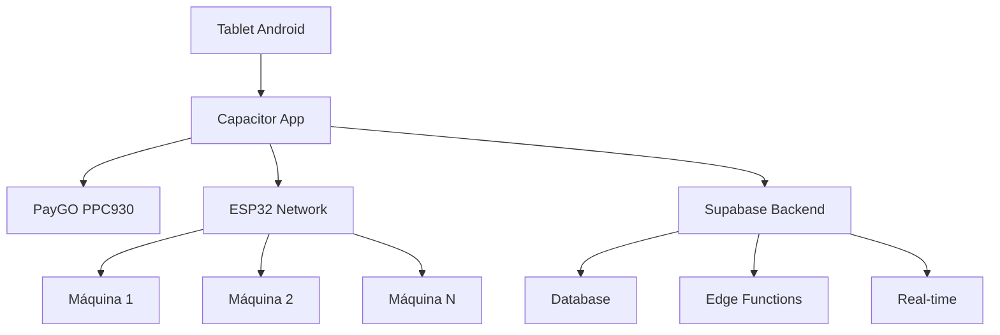
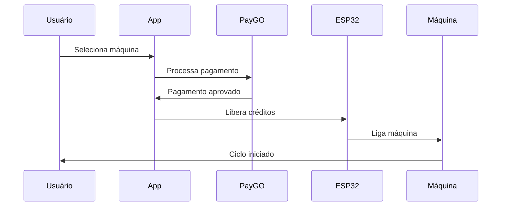

# TopLavanderia - Documentação Completa

## 📚 Índice Geral

Bem-vindo à documentação completa do TopLavanderia, sistema integrado de gestão para lavanderias com pagamentos automáticos.

### 🚀 Início Rápido
- **[Quick Start Guide](01-GUIA-INICIAL/QUICK-START.md)** - Configure em 5 minutos
- **[Integration Guide](../INTEGRATION_GUIDE.md)** - Guia de integração completo
- **[README Principal](../README.md)** - Visão geral do projeto

### 💳 Integração PayGO
- **[PayGO PPC930 Documentation](02-PAYGO-INTEGRATION/PAYGO_PPC930_DOCUMENTATION.md)** - Documentação completa
- **[PayGO Integration Guide](../DEPLOYMENT_TOTEM/PAYGO_INTEGRATION_GUIDE.md)** - Guia de integração
- **[PayGO Troubleshooting](02-PAYGO-INTEGRATION/PAYGO_TROUBLESHOOTING.md)** - Solução de problemas

### 🖥️ Deployment Totem
- **[Build Instructions](../DEPLOYMENT_TOTEM/build_instructions.md)** - Como fazer build
- **[Deployment Checklist](../DEPLOYMENT_TOTEM/deployment_checklist.md)** - Lista de verificação
- **[README Totem](../DEPLOYMENT_TOTEM/README_TOTEM.md)** - Documentação específica
- **[Config Template](../DEPLOYMENT_TOTEM/config_template.json)** - Template de configuração

### ⚡ Hardware ESP32
- **[ESP32 Implementation](../ESP32_IMPLEMENTATION.md)** - Implementação completa
- **[Configuração Bluetooth](../CONFIGURACAO_TABLET_BLUETOOTH.md)** - Setup Bluetooth
- **[Instruções de Atualização](../ATUALIZACAO_TABLET_INSTRUCOES.md)** - Como atualizar

### 🔧 Documentação Técnica
- **[API Endpoints](05-TECHNICAL/API_ENDPOINTS.md)** - Todos os endpoints disponíveis
- **[Database Schema](05-TECHNICAL/DATABASE_SCHEMA.md)** - Estrutura do banco de dados
- **[Security Guide](05-TECHNICAL/SECURITY_GUIDE.md)** - Guia de segurança

### 🆘 Suporte
- **[FAQ](06-SUPPORT/FAQ.md)** - Perguntas frequentes
- **[Contact Info](06-SUPPORT/CONTACT_INFO.md)** - Informações de contato

## 📋 Visão Geral do Sistema

### Arquitetura Principal


### Fluxo de Pagamento


## 🚀 Tecnologias Utilizadas

### Frontend/Mobile
- **React** + **TypeScript** - Interface principal
- **Capacitor** - Framework híbrido mobile
- **Tailwind CSS** - Estilização
- **Shadcn/ui** - Componentes UI

### Backend
- **Supabase** - Backend-as-a-Service
- **PostgreSQL** - Banco de dados principal
- **Row Level Security** - Segurança de dados
- **Edge Functions** - Processamento serverless

### Hardware/Integração
- **PayGO PPC930** - Terminal de pagamento
- **ESP32** - Controle das máquinas
- **Android SDK** - Integração nativa

### Desenvolvimento
- **Vite** - Build tool
- **ESLint** - Code linting
- **Git** - Controle de versão

## 🏗️ Estrutura do Projeto

```
toplavanderia/
├── android/                     # Projeto Android nativo
│   ├── app/src/main/java/      # Plugins Capacitor (PayGO)
│   └── app/libs/               # Biblioteca PayGO (.aar)
├── docs/                       # Documentação completa
│   ├── 01-GUIA-INICIAL/       # Guias de início
│   ├── 02-PAYGO-INTEGRATION/  # Docs PayGO
│   ├── 05-TECHNICAL/          # Documentação técnica
│   └── 06-SUPPORT/            # Suporte e FAQ
├── src/
│   ├── components/            # Componentes React
│   ├── hooks/                 # React hooks customizados
│   ├── pages/                 # Páginas da aplicação
│   └── plugins/               # Plugins Capacitor
├── supabase/
│   └── functions/             # Edge Functions
├── DEPLOYMENT_TOTEM/          # Docs de deployment
└── *.md                       # Documentação raiz
```

## 🎯 Funcionalidades Principais

### ✅ Implementadas
- [x] Interface de usuário responsiva
- [x] Integração PayGO PPC930 completa
- [x] Pagamentos por cartão (crédito/débito)
- [x] PIX via PayGO
- [x] Controle ESP32 das máquinas
- [x] Sistema de administração
- [x] Diagnósticos em tempo real
- [x] Fallback universal de pagamentos
- [x] Logs e auditoria
- [x] Sistema de usuários (Supabase Auth)

### 🚧 Em Desenvolvimento
- [ ] Dashboard analytics avançado
- [ ] Notificações push
- [ ] Sistema de fidelidade
- [ ] Integração com outros terminais
- [ ] API REST pública

### 📋 Roadmap
- [ ] Suporte iOS
- [ ] Multi-tenant (várias lavanderias)
- [ ] BI e relatórios avançados
- [ ] Integração com ERPs
- [ ] Sistema de reservas

## 🔧 Configuração Rápida

### Pré-requisitos
- Node.js 18+
- Android Studio
- Git
- Terminal PayGO PPC930

### Instalação
```bash
# Clone o projeto
git clone [repository-url]
cd toplavanderia

# Instale dependências
npm install

# Configure Capacitor
npx cap init

# Adicione plataforma Android
npx cap add android

# Sincronize
npx cap sync

# Execute no dispositivo
npx cap run android
```

### Configuração PayGO
```json
{
  "host": "192.168.1.100",
  "port": 3000,
  "automationKey": "sua-chave-aqui",
  "timeout": 30000
}
```

## 📖 Guias por Cenário

### 👨‍💻 Desenvolvedor
1. [Quick Start](01-GUIA-INICIAL/QUICK-START.md) - Setup inicial
2. [API Endpoints](05-TECHNICAL/API_ENDPOINTS.md) - APIs disponíveis
3. [Database Schema](05-TECHNICAL/DATABASE_SCHEMA.md) - Estrutura de dados
4. [Security Guide](05-TECHNICAL/SECURITY_GUIDE.md) - Boas práticas

### 🏪 Operador/Administrador
1. [PayGO Integration Guide](../DEPLOYMENT_TOTEM/PAYGO_INTEGRATION_GUIDE.md) - Setup PayGO
2. [Deployment Checklist](../DEPLOYMENT_TOTEM/deployment_checklist.md) - Lista de deployment
3. [FAQ](06-SUPPORT/FAQ.md) - Perguntas frequentes
4. [Troubleshooting](02-PAYGO-INTEGRATION/PAYGO_TROUBLESHOOTING.md) - Solução de problemas

### 🔧 Técnico de Manutenção
1. [ESP32 Implementation](../ESP32_IMPLEMENTATION.md) - Hardware ESP32
2. [PayGO Troubleshooting](02-PAYGO-INTEGRATION/PAYGO_TROUBLESHOOTING.md) - Diagnósticos
3. [Contact Info](06-SUPPORT/CONTACT_INFO.md) - Suporte técnico

## 🎯 Casos de Uso Comuns

### Pagamento com Cartão
```typescript
const payment = await PayGO.processPayment({
  paymentType: 'credit',
  amount: 25.50,
  orderId: 'wash-' + Date.now()
});
```

### Pagamento PIX
```typescript
const pix = await PayGO.processPayment({
  paymentType: 'pix',
  amount: 25.50,
  orderId: 'pix-' + Date.now()
});
// QR Code gerado automaticamente
```

### Liberar Créditos na Máquina
```typescript
const release = await ESP32.releaseCredits({
  machineId: 'machine-01',
  credits: 1,
  esp32Ip: '192.168.1.200'
});
```

## 📊 Métricas e Monitoramento

### KPIs Importantes
- **Taxa de sucesso** de transações PayGO
- **Tempo médio** de processamento
- **Uptime** do sistema ESP32
- **Satisfação** do usuário

### Logs Essenciais
- Transações PayGO (sucesso/falha)
- Conexões ESP32
- Erros de sistema
- Performance de queries

## 🚨 Troubleshooting Rápido

### PayGO não conecta
1. Verificar cabo USB
2. Confirmar IP/porta
3. Testar chave de automação
4. Reiniciar terminal

### Máquina não liga
1. Verificar ESP32 online
2. Testar relé manualmente
3. Conferir configuração
4. Verificar alimentação

### App trava
1. Force close
2. Limpar cache
3. Verificar logs
4. Reinstalar se necessário

## 📞 Suporte

### Suporte Técnico
- **Email:** suporte@toplavanderia.com
- **GitHub:** [repository-url]/issues
- **Horário:** Segunda a Sexta, 8h-18h

### Emergência (24/7)
- **Email:** emergency@toplavanderia.com
- **Apenas para:** Production down

### Comunidade
- **Discord:** [invite-link]
- **FAQ:** [FAQ.md](06-SUPPORT/FAQ.md)

---

## 📄 Licença

[Especificar licença - MIT, GPL, etc.]

## 🤝 Contribuindo

Veja nosso [guia de contribuição] para como participar do desenvolvimento.

## 📈 Changelog

Veja [CHANGELOG.md] para histórico de versões.

---

**Última atualização:** [data atual]  
**Versão da documentação:** 1.0  
**Compatível com app:** v1.x.x

*Esta documentação é atualizada continuamente. Para a versão mais recente, sempre consulte o repositório principal.*